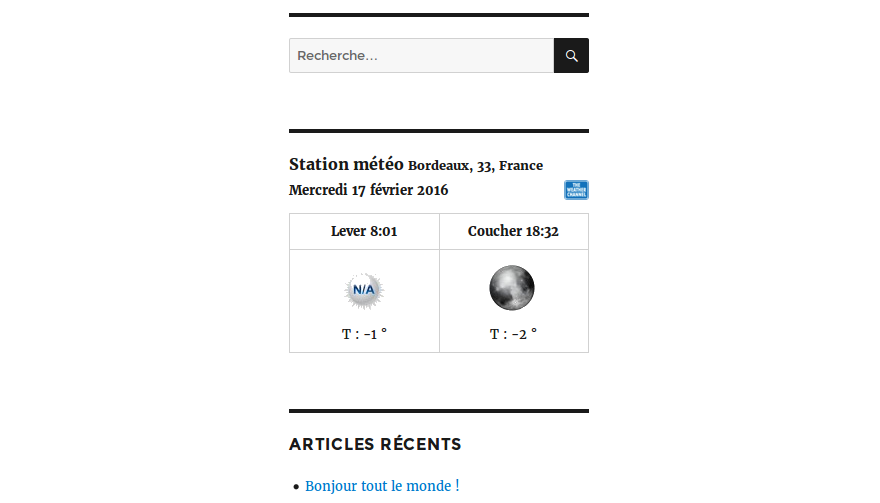

# Weather Forecast Wordpress Plugin

Wordpress plugins - Display forecast weather in blog using The Weather Channel service.

## fs-forecast
Contributors: franckysolo  
Author website : http://www.franckysolo-productions.com/  
Tags: weather,forecast,sidebar,plugin,wordpress  
Requires at least: wordpress 4.4  
Tested up to: wordpress 4.4  
Stable tag: wordpress 4.4  
License: GPLv2 or later  
License URI: http://www.gnu.org/licenses/gpl-2.0.html  

    Wordpress plugins - Display forecast weather in blog using The Weather Channel service.  
## Description
This first version of the plugin display a simple widget in the sidebar area.  
You can change the weather station in admin panel, in the Forecast settings plugin.  
Stations codes could be found on the Weather Channel service, a link is provided on admin settings.  
A list of stations will be provided in future version.  
The plugin has been translated in two languages versions : en_US & fr_FR  

## Installation

1. Download zip from github `https://github.com/franckysolo/fs-forecast`
1. Extract the zip to the `/wp-content/plugins/` directory  
1. Activate the plugin through the 'Plugins' menu in WordPress  
1. Place the plugin widget in the sidebar  

## Frequently Asked Questions

1. How to add other language?  
If you want to add for example de_DE translation, you need to create a `fs-forecast-de_DE.po` file in languages directory
update the file, fill the translations, save and exit. Reload your page and check if translations are avaliables.

2. How can I customize the widget?  
You can modify the CSS file on `public/css` plugin directory  
To modify the HTML structure of the widget a view is provided in `public/partials` directory

3. How can I have more informations than temperature?  
The api plugin store more than 1 day forecast, it's storing 5 days weathers forecast  and the current day forecast with all informations.  
But the view implementation is not ready yet so you'll have to done it if you don't want to wait for the next version.  
Just var_dump the report api and take a look at the plugin class api and report in order to make your own development

## Screenshots

## Changelog

### 1.0 The prototype version
The plugin as a simple widget! May be improved in future version.

## Upgrade Notice
No information for now...

## Contribute
Send me an email
